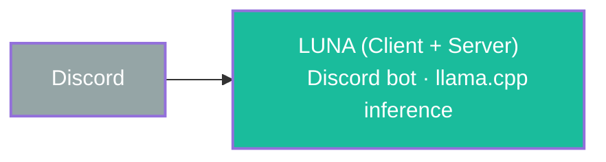

# 1. LUNA Client-Server (Monolith)

The very first iteration. One codebase, one process. The bot connects directly to Discord and runs llama.cpp inference in-process or as a sidecar.

**No separation of concerns.** Behavior, routing, inference, and platform logic all live together. Adding Matrix would mean forking or duplicating the entire codebase.

Portfolio repo with a single `luna` binary. No WebSocket, no HTTP services — just one entry point.
