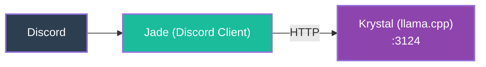

# 2. Jade + Krystal (Monolith Split)

The monolith is split into two services. **Jade** becomes the Discord client (named after the green gem). **Krystal** becomes the dedicated llama.cpp inference server. No concept of "small" vs "large" model yet — Krystal is just one server.

**Key change**: Separation of concerns. Jade handles Discord events and response formatting; Krystal handles LLM inference. Jade can now be restarted without dropping the model from RAM. First step toward a multi-platform architecture.
