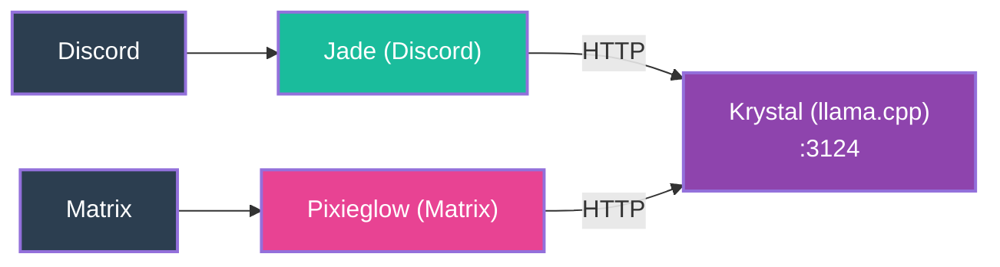

# 3. Pixieglow Joins (Multi-Platform)

**Pixieglow**, the Matrix adapter, is added. It follows the same pattern as Jade: connects to a platform (Matrix) and talks directly to Krystal for inference. No shared brain yet — each adapter manages its own logic.

**Key change**: LUNA is now multiplatform. But each adapter duplicates behavior logic — Jade and Pixieglow both implement their own response routing, state management, and prompt construction. Maintaining feature parity across two codebases is becoming painful.
