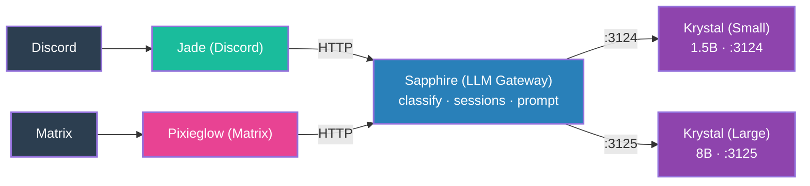

# 4. Sapphire (LLM Gateway & Classification)

**Sapphire** is introduced as a dedicated LLM gateway service. It handles:
- **Classification** — marking messages as `intéressant` (interesting) or `futile` (pointless) via embedding-based centroid matching
- **Session management** — per-channel conversation history
- **Prompt construction** — few-shot example injection, emotion-aware formatting
- **Degenerate output detection** — filters bad responses, triggers retries

Krystal now runs **two instances**: a small model (1.5B for `futile` messages) and a large model (8B for `intéressant` messages). But the small/large naming convention is not yet formalized.

**Key change**: Classification logic is extracted from the adapters into a shared service. Both Jade and Pixieglow now talk to Sapphire instead of directly to Krystal. The two-tier inference (small vs. large model) appears for the first time. But the adapters still contain behavior/routing logic — they're not yet pure adapters.
