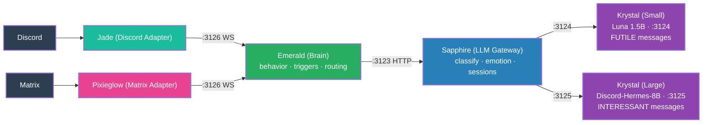

# 5. Emerald (Brain Service)

**Emerald** is introduced as the central brain. It mutualizes all the behavior, routing, and state management that was previously duplicated across Jade and Pixieglow. The adapters become **pure adapters** — they forward platform events to Emerald over WebSocket and post responses back. No more "thinking" in the adapters.

Sapphire is renamed from "LLM Gateway" to a classification + prompt service. The two Krystal instances are formalized: **Krystal (Small)** for `FUTILE` messages, **Krystal (Large)** for `INTERESSANT` messages.

**Key change**: Architecture is now cleanly layered. Platform → Adapter (WS) → Emerald → Sapphire → Krystal. Adapters are thin (<300 lines of real logic). All behavior lives in Emerald. WebSocket replaces HTTP for adapter ↔ brain communication to enable streaming.
