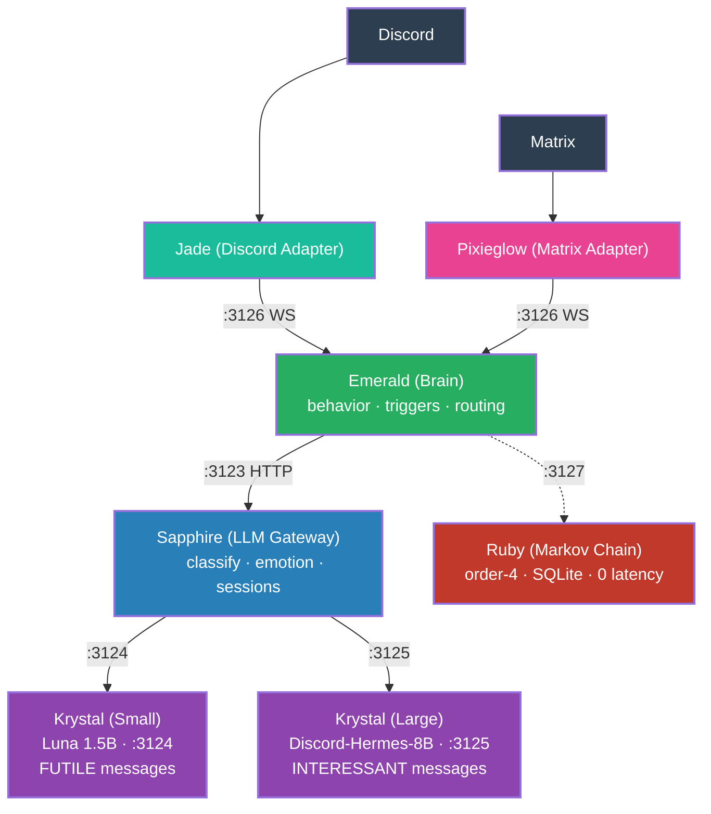

# 6. Ruby (Markov Chain Spontaneity)

**Ruby** is added as a lightweight Markov chain service (order-4, SQLite-backed). It generates spontaneous, context-free messages from real conversation data. Emerald calls Ruby for random triggers or when the bot hasn't spoken in a while.

This completes the architecture. Ruby is optional (dashed line), purely spontaneous — no prompt, no model loading, zero latency.

**Final architecture**: 6 services, 5 repos (Krystal is one service with two instances), 2 platforms. Emerald is the single source of truth for behavior. Every service has a single responsibility.
