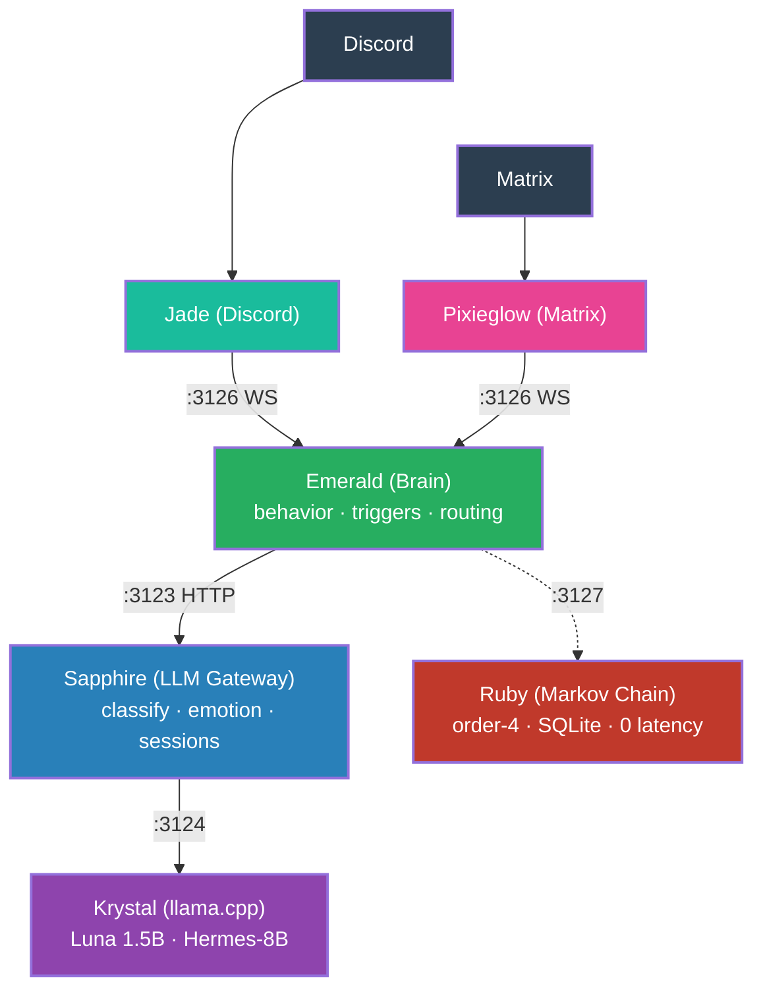
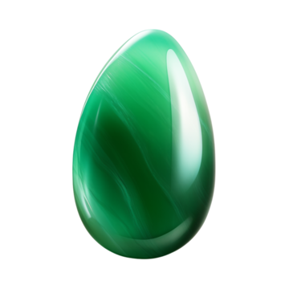

<p align="center">
  
  <h1 align="center">Protocol Luna</h1>
  <p align="center">Autonomous, sentient-like AI bots powered by local LLM inference</p>
  <p align="center">
    <a href="https://protocol-luna.github.io">
      
    </a>
    <a href="https://github.com/protocol-luna/.github">
      
    </a>
    <a href="https://huggingface.co/fox3000foxy/Luna-Protocol-1.5B-Discord-Dialogues-200k-instruct">
      
    </a>
    <a href="https://discord.gg/">
      
    </a>
    <a href="https://matrix.org/">
      
    </a>
  </p>
</p>

An open-source multi-platform AI assistant ecosystem with a modular architecture. The brain service (**Emerald**) connects to platform adapters (Discord, Matrix) and an LLM gateway (**Sapphire**) backed by llama.cpp (**Krystal**).

## What is LUNA?

**LUNA** stands for **Lifelike User-like Neural Agent** -- an autonomous conversational AI designed to mimic human imperfections and social behavior.

## Architecture



> 📐 [Detailed architecture & state machine diagrams](state-machines/)

### Services

<table>
  <tr>
    <th>Service</th>
    <th>Role</th>
    <th>Port</th>
    <th>Language</th>
    <th>Logo</th>
  </tr>
  <tr>
    <td><strong>Emerald</strong></td>
    <td>Brain & behavior engine</td>
    <td>3126</td>
    <td>TypeScript</td>
    <td></td>
  </tr>
  <tr>
    <td><strong>Sapphire</strong></td>
    <td>LLM gateway (sessions, classification, prompting)</td>
    <td>3123</td>
    <td>Python</td>
    <td></td>
  </tr>
  <tr>
    <td><strong>Krystal</strong></td>
    <td>LLM inference (llama.cpp)</td>
    <td>3124</td>
    <td>C++</td>
    <td></td>
  </tr>
  <tr>
    <td><strong>Jade</strong></td>
    <td>Discord adapter</td>
    <td>--</td>
    <td>TypeScript</td>
    <td></td>
  </tr>
  <tr>
    <td><strong>Pixieglow</strong></td>
    <td>Matrix adapter</td>
    <td>--</td>
    <td>TypeScript</td>
    <td></td>
  </tr>
  <tr>
    <td><strong>Ruby</strong></td>
    <td>Markov chain service</td>
    <td>3127</td>
    <td>TypeScript</td>
    <td></td>
  </tr>
</table>

### Data Flow

1. User sends a message on Discord or Matrix
2. The adapter (Jade/Pixieglow) forwards it to Emerald via WebSocket
3. Emerald evaluates behavior rules (burst, typo, sleep, mannerisms)
4. Emerald decides: random/spontaneous triggers → Ruby (Markov chain), all others → Sapphire
5. If Sapphire: classifies the message (emotion valence/arousal, category), manages conversation sessions, injects few-shot examples, and constructs the prompt
6. Sapphire calls Krystal with emotion-aware sampling parameters
7. Sapphire checks for degenerate responses and retries if needed
8. Sapphire returns the response text (and optionally debug stats)
9. Emerald applies typo/swap behavior and sends a `RespondCommand` back to the adapter
10. The adapter posts the response to the platform

## Behavior System

The bot doesn't just generate text -- it decides *when*, *how*, and *whether* to respond, simulating human imperfections:

| Behavior | Description |
|----------|-------------|
| **Sleep cycles** | Circadian rhythm -- ignores messages during rest hours, slows down when drowsy |
| **Typo injection** | Keyboard-mistake realism with delayed self-correction |
| **Hesitation** | Filler words injected post-generation ("uh...", "hmm...") |
| **Burst mode** | Splits long responses into timed fragments |
| **Topic fatigue** | Gets bored of repetitive topics -- longer delays, higher ignore chance |
| **Forget chance** | Silently drops messages 3% of the time |
| **Follow-up detection** | Chains up to 3 rapid replies in active conversations |

## Features

- **Multi-platform** -- Discord (Jade) and Matrix (Pixieglow) with the same brain backend
- **Emotion-aware LLM** -- Valence/arousal classification adjusts sampling parameters
- **Few-shot learning** -- Category-matched example injection from YAML files
- **Session management** -- Per-channel conversation history
- **Markov chain spontaneity** -- Ruby generates context-free messages from real conversation data
- **Debug mode** -- End-to-end token counting and timing across all layers
- **Single small model** -- Luna Protocol 1.5B Q4_K_M fits in ~3 GB RAM

## Repositories

| Repository | Description | Language | Status |
|------------|-------------|----------|--------|
| [emerald](https://github.com/protocol-luna/emerald) | Brain & behavior engine | TypeScript | Active |
| [sapphire](https://github.com/protocol-luna/sapphire) | LLM gateway | Python | Active |
| [krystal](https://github.com/protocol-luna/krystal) | LLM inference | C++ | Active |
| [jade](https://github.com/protocol-luna/jade) | Discord adapter | TypeScript | Active |
| [pixieglow](https://github.com/protocol-luna/pixieglow) | Matrix adapter | TypeScript | Active |
| [ruby](https://github.com/protocol-luna/ruby) | Markov chain | TypeScript | Active |
| [protocol-luna.github.io](https://github.com/protocol-luna/protocol-luna.github.io) | Website | HTML/CSS | Active |

## Deployment

- All services run on a single VPS managed by PM2
- WebSocket :3126 (Emerald ↔ bots)
- HTTP :3123 (Emerald ↔ Sapphire)
- HTTP :3124 (Sapphire ↔ Krystal)
- HTTP :3127 (Emerald ↔ Ruby)
- Cloudflared tunnel for Matrix federation
- GitHub Pages serves `protocol-luna.github.io`

## Get Started

```bash
# 1. LLM inference
git clone https://github.com/protocol-luna/krystal.git && cd krystal && ./start.sh

# 2. LLM gateway
git clone https://github.com/protocol-luna/sapphire.git && cd sapphire && pip install -r requirements.txt && python server.py

# 3. Brain service
git clone https://github.com/protocol-luna/emerald.git && cd emerald && npm install && npm start

# 4. Markov chain (optional)
git clone https://github.com/protocol-luna/ruby.git && cd ruby && npm install && npm start

# 5. Platform adapter (Discord or Matrix)
git clone https://github.com/protocol-luna/jade.git  # or pixieglow
```

---

<p align="center">
  <sub>Built with ❤️ and <a href="https://llama.cpp/">llama.cpp</a></sub>
</p>

