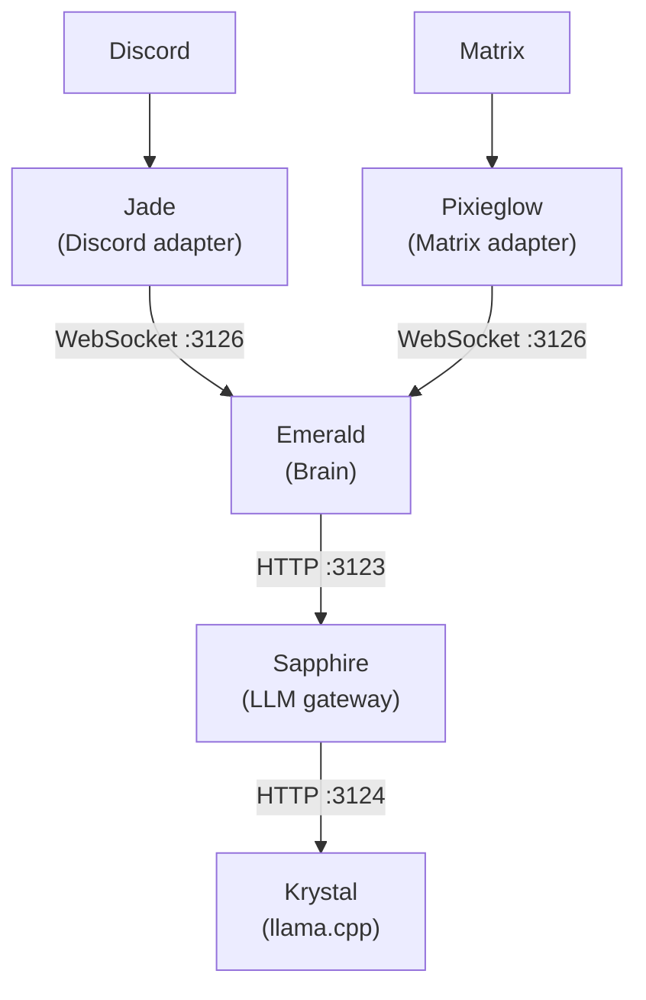

# Luna Protocol

An open-source multi-platform AI assistant ecosystem with a modular architecture. The brain service (**Emerald**) connects to platform adapters (Discord, Matrix) and an LLM gateway (**Sapphire**) backed by llama.cpp (**Krystal**).

## Architecture

### Components

| Service | Role | Port | Language |
|---------|------|------|----------|
| **Emerald** | Brain & behavior engine | 3126 | TypeScript |
| **Sapphire** | LLM gateway (sessions, classification, prompting) | 3123 | Python |
| **Krystal** | LLM inference (llama.cpp) | 3124 | C++ |
| **Jade** | Discord adapter | — | TypeScript |
| **Pixieglow** | Matrix adapter | — | TypeScript |

### Data Flow

1. User sends a message on Discord or Matrix
2. The adapter (Jade/Pixieglow) forwards it to Emerald via WebSocket
3. Emerald evaluates behavior rules (burst, typo, sleep, mannerisms)
4. Emerald calls Sapphire's HTTP API with the message and behavior context
5. Sapphire classifies the message (emotion valence/arousal, category), manages conversation sessions, injects few-shot examples, and constructs the prompt
6. Sapphire calls Krystal with emotion-aware sampling parameters (temperature by arousal, repeat penalty by valence)
7. Sapphire checks for degenerate responses and retries if needed
8. Sapphire returns the response text (and optionally debug stats)
9. Emerald applies typo/swap behavior and sends a `RespondCommand` back to the adapter
10. The adapter posts the response to the platform

### Debug Mode

Any adapter can pass `debug: true` on message events. This flows through the entire stack:

- Emerald passes `"debug": true` to Sapphire
- Sapphire returns token counts, timing, emotion state, and classification confidence
- Emerald maps snake_case → camelCase and includes `DebugStats` in the respond command
- The adapter appends `-# ` formatted stat lines to the Discord/Matrix response

## Features

- **Multi-platform** — Discord (Jade) and Matrix (Pixieglow) with the same brain backend
- **Behavior system** — Configurable burst, sleep schedule, typo/swap, mannerisms
- **Emotion-aware LLM** — Valence/arousal classification adjusts sampling parameters
- **Few-shot learning** — Category-matched example injection from YAML files
- **Session management** — Per-channel conversation history
- **Debug mode** — End-to-end token counting and timing across all layers
- **Single small model** — Luna Protocol 1.5B Q4_K_M fits in ~3 GB RAM

## Deployment

- All services run on a single VPS managed by PM2
- WebSocket :3126 (Emerald ↔ bots)
- HTTP :3123 (Emerald ↔ Sapphire)
- HTTP :3124 (Sapphire ↔ Krystal)
- Cloudflared tunnel `matrix` handles `matrix.fox3000foxy.com → palpo (8008)` and `luna.fox3000foxy.com → tuwunel (8009)`
- GitHub Pages serves `protocol-luna.github.io` from `.github/workflows/static.yml`

## Repositories

- [emerald](https://github.com/Luna-Protocol/emerald) — Brain service
- [sapphire](https://github.com/Luna-Protocol/sapphire) — LLM gateway
- [krystal](https://github.com/Luna-Protocol/krystal) — LLM inference
- [jade](https://github.com/Luna-Protocol/jade) — Discord adapter
- [pixieglow](https://github.com/Luna-Protocol/pixieglow) — Matrix adapter
- [protocol-luna.github.io](https://github.com/Luna-Protocol/protocol-luna.github.io) — Website
