# State Machines & Flowcharts -- Luna Protocol

Architecture diagrams, state machines, and flowcharts for the [Luna Protocol](https://github.com/protocol-luna) ecosystem -- 6 services running across Discord and Matrix.

**Source files:** `.mmd` (Mermaid syntax) -- viewable on GitHub or [mermaid.live](https://mermaid.live/edit).  
**Exports:** `.svg` in [`output/`](output/).

---

## 00 -- Mega Architecture

All 6 services, their internal features, and data flow across all layers: Platform → Adapter → Brain → Service → Inference.

## 01 -- Emerald Trigger Evaluation

The 13-step cascade that decides whether a message gets a response: commands, mentions, DMs, cooldown, name/keyword matching, follow-up detection, and random chance.

## 02 -- Emerald Behavior Engine

How Emerald simulates human-like behavior: circadian rhythm (sleep/slow/short), burst messages (2-3 fragments), keyboard typos, letter swaps, hesitation words, forgetting, reactions, voice flags, and delay computation with reading time + inactivity warmup + fatigue.

## 03 -- Emerald Response Routing

The decision tree that routes to either Ruby (Markov chain, no LLM) or Sapphire (full LLM pipeline), then applies behavior modifiers and sends the RespondCommand back to the bot.

## 04 -- Sapphire Request Pipeline

The full /v1/respond flow: BGE embedding → centroid classification (FUTILE/INTERESSANT) → emotion scoring (valence/arousal) → EMA update → session management → few-shot injection → emotion-aware sampling params → Krystal call with degenerate retry → user leak truncation → response.

## 05 -- Ruby Markov Chain

Tokenization, training (sliding window upsert into SQLite), and weighted-random generation from order-4 Markov transitions.

## 06 -- Krystal Dual Mode

llama-server orchestration: small mode (Luna 1.5B, :3124, CPU 0) vs large mode (Hermes-8B, :3125, CPU 0,1), taskset pinning, PM2 lifecycle.

## 07 -- Bot Adapter Lifecycle

How Jade (Discord) and Pixieglow (Matrix) connect to Emerald via WebSocket, forward messages, and execute response commands (delay, typing indicator, burst, typo correction, TTS).
